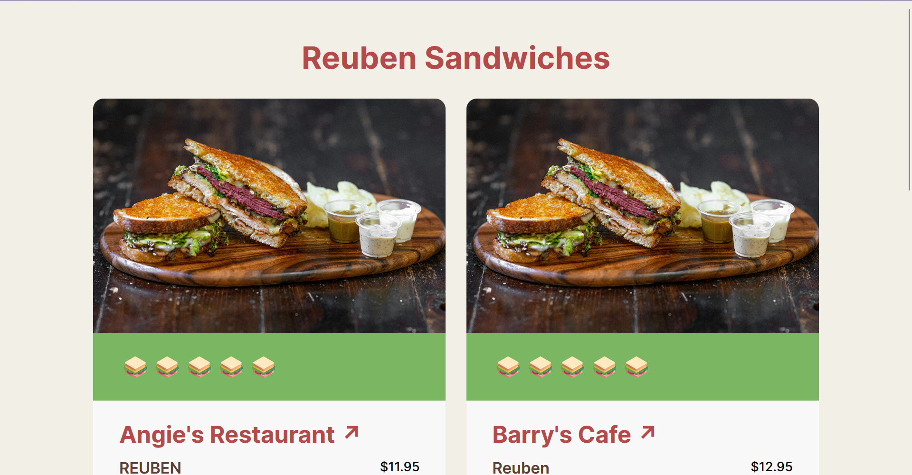

# Reuben Sandwiches

**A curated guide to Raleigh’s top Reuben sandwiches.**



### Live link: https://geraldiner.github.io/reuben-sandwiches/

This website is inspired by Chris Coyier's [Breakfast Burritos in Bend, Oregon](https://breakfast-burritos.chriscoyier.net/), which I originally discovered in his post on the Frontend Masters Blog, [50 Reasons to Build a Website](https://frontendmasters.com/blog/50-reasons-to-build-a-website/?utm_source=cassidoo&utm_medium=email&utm_campaign=change-your-life-today-dont-gamble-on-the-future).

Stay tuned for an upcoming tutorial to go along with this! Or if you're interested, I have it [mocked in Figma](https://www.figma.com/design/xn7zRq1m7FRtzthczoWU1e/Reuben-Sandwiches?node-id=1-2&t=IIpU2b7b833KMxwM-1).

## How It's Made

Since the inspiration is made in Astro, I also built this project with Astro, Astro Content Collections, Tailwind CSS, and is deployed to GitHub Pages.

### Astro and Astro Content Collections

Astro is a new framework for me. We've been exploring it at work for the static part of our public-facing website, so I thought I'd build something small to play around with it.

Astro describes itself as: "The web framework for content-driven websites." For something like a list of Reuben sandwiches, it lends itself well. Each entry has the same kind of data:

```tsx
// Reuben sandwich schema for Astro Content Collection
restaurant: string; // Name of the restaurant
website: string; // Google Maps URL for the restaurant
item: string; // The name of the Reuben on the menu
sides: string; // The side(s) I like to have it with
stars: number; // Star rating out of 5
imageThumbnail: string; // path/to/image file in assets
price: number; // Price of the sandwich
closed: boolean; // Whether or not the place is still open,
```

I chose the Google Maps URL for the website, since not all restaurants have one, and I wanted to link the specific one I go to, in cases where there are other locations.

With Astro Content Collections, I can save each entry as a Markdown file with these props in the frontmatter, and the review as the `Content`.

All of them together becomes the `reubens` collection as defined in `content.config.ts`:

```ts
const reubens = defineCollection({
  loader: glob({ pattern: '**/*.md', base: './src/content/reubens' }),
  schema: ({ image }) =>
    z.object({
      restaurant: z.string(),
      website: z.string().url(),
      item: z.string(),
      sides: z.string().optional(),
      stars: z.number(),
      imageThumbnail: image(),
      price: z.number(),
      closed: z.boolean().optional(),
    }),
});
```

The `reubens` collection will only pull the `.md` files from the `./src/content/reubens` directory, and should have the schema as described above.

Although the functionality is `async`, it's still pretty cool to be able to get all the Markdown files as data for the card grid just with one call:

```tsx
import { getCollection, render, type CollectionEntry } from 'astro:content';

import ItemCard from '../components/ItemCard.astro';
import Layout from '../layouts/Layout.astro';

type ReubenEntry = CollectionEntry<'reubens'>;

let reubens = await getCollection('reubens');
reubens.sort(
  (a: ReubenEntry, b: ReubenEntry) =>
    b.data.stars - a.data.stars ||
    a.data.restaurant.localeCompare(b.data.restaurant)
);
```

Then, they're sorted by rating first, in descending order, and then in alphabetical order.

### TailwindCSS

TailwindCSS might be one of the greatest things since sliced bread.

That's an exaggeration. But it's so fast and easy to use, and even more so since you can just run `npx astro add tailwind` to add it to an Astro project.

I do admit that this would've been a good project to exercise my vanilla CSS (or CSS from scratch) skills on a lighter project.

Something new for me is that I got to work with v4, which was released a month after we'd just introduced v3 at work, and hadn't had the chance to migrate yet. For the most part it's the same in use, but a few differences in the config and customization.

Rather than having them defined in `tailwind.config.js`, they were added straight to the main `global.css` file:

```css
@import 'tailwindcss';

@theme {
  --default-font-family: 'Inter', sans-serif;

  --color-*: initial;
  --color-cornedbeef: #b44b4b;
  --color-sauerkraut: #efa472;
  --color-cabbage: #7bb662;
  --color-napkin: #f2f0e6;
  --color-bread: #5c4033;
  --color-white: #f8f8f8;
  --color-black: #2b2b2b;
}
```

(Yes, I did name the colors after sandwich-related things.)

### GitHub Pages (and GitHub Actions)

I chose to deploy on GitHub pages because the project is lightweight (compared to something like Netlify or Vercel). I just needed a place to put the site at a live link, which GitHub pages is easy to do with.

Plus, I could set up a GitHub Action to trigger another deploy on pushes to the `main` branch. I figure that most updates will be new reviews of Reubens, which would only require a new Markdown file with the information for the new entry.

## Using ChatGPT

As the use of AI continues to permeate all sectors, I've been trying my hand at "vibe coding", to see if it lives up to the hype.

For the most part, I like to use ChatGPT as a much faster search. But I've noticed that it does return untrue or inaccurate results, so I'm very wary.

For this project, I asked ChatGPT to give me starter files to set up the project that included an ESLint, Prettier, and Vitest configs.

I had to restart from scratch almost 3 times. 😅

It kept messing up the ESLint config for `.astro` files, since I guess the Astro ESLint plugin hasn't caught up with the new flat style config for ESLint.

I also had a bit of a major headache setting up Vitest, and only discovered later that v4 has also just been released, so this project is currently using v3.

I eventually did what I should've done in the first place and Consulted. The. Docs!

I will also say that I'm sure prompt-engineering has its own skillset, and I'm just not there yet. I will keep trying though. I recognize AI as another powerful tool in the Software Engineer's toolkit.

## 🚀 Other Projects

Check out other stuff I've worked on:

**Reuben Sandwiches**: https://github.com/geraldiner/reuben-sandwiches

**Nook Music**: https://github.com/geraldiner/nook-music

**Animal Crossing API**: https://github.com/geraldiner/ac-api

## 🤙 Let's connect

- Website: [geraldiner.com](https://geraldiner.com)
- Resume: [Geraldine R](https://geraldiner.com/GeraldineRagsac_Resume.pdf)
- LinkedIn: [in/geraldiner](https://linkedin.com/in/geraldiner)
- Sometimes I write: [@geraldiner](https://geraldiner.hashnode.dev)
- For crochet work: [@geraldinedesu](https://instagram.com/geraldinedesu)
